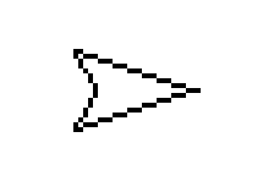
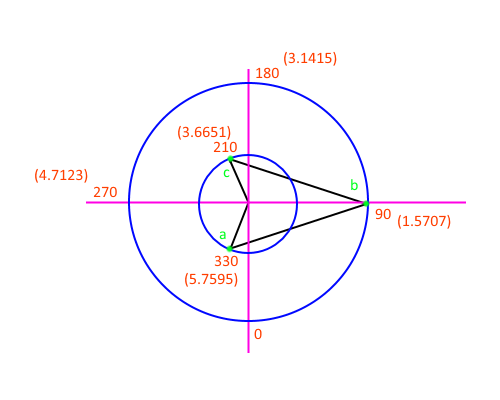

# u8g2 rotatable arrow

## Features

 - Only three functions required:
 
   `arrow(x, y, degrees);`
   
   `deg2rad(degrees);`
   
   `cap(in);`
   
 - Adjustable shape with:
 
   `inner_radius`
   
   `outer_radius`
   
 - Values under 0 are supressed

_arrow example_

_arrow construction_
